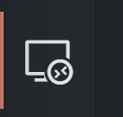
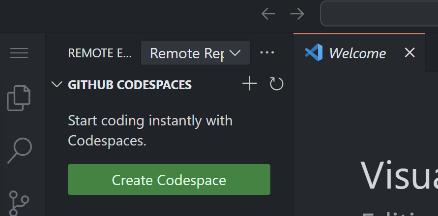
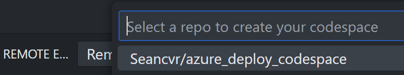
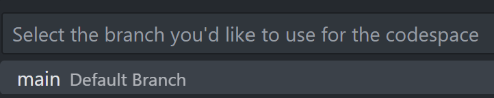
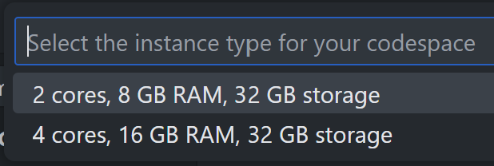
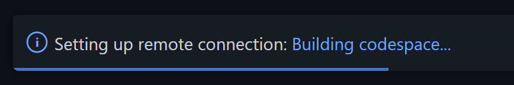

# Terraform deployment codespace
This repository contains the instructions for creating a custom codespace for deploying resources to the cloud with Terraform. 
Currently it's just configured with Azure cli, but it can be customized to integrate with other cloud providers.    

It contains the following tools:

- Azure cli
- Terraform
- git
- wget
- curl

The tooling for this container can be customized in the devcontainer.json and Dockerfile files. 
## Creating a codespace

With the Visual Studio Code "Remote Explorer" icon selected, 

  

click the "Create Codespace" button.

  

Select the repo with the devcontainer.json and Dockerfile that specifies your desired container.

  

Select the repository branch, in this case the main branch. 

  

Select the resources you would like to allocate to your codespace.

  

After that your codespace window will open, with a progress bar at the bottom right showing the build status. 

  

